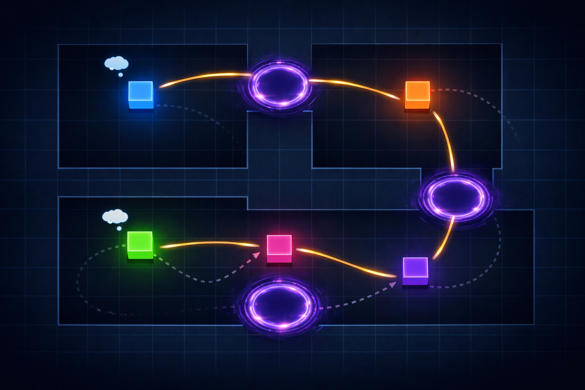
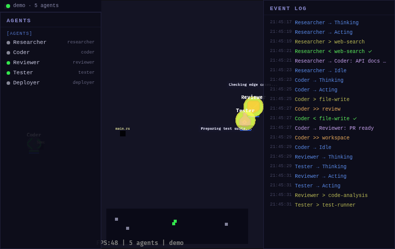
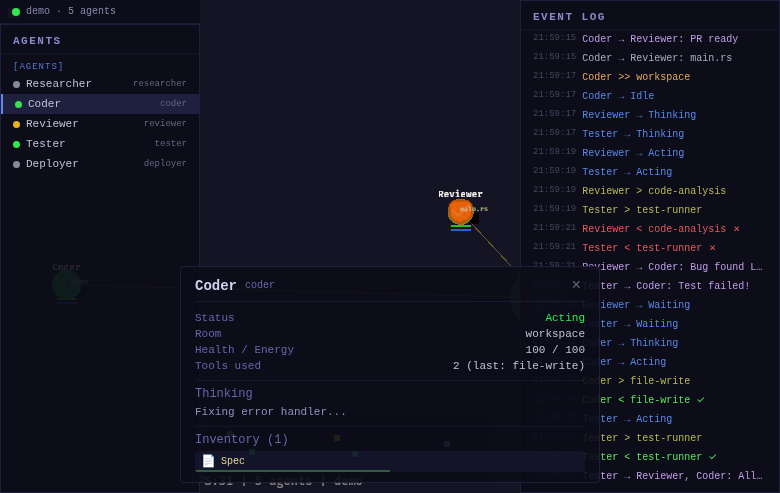
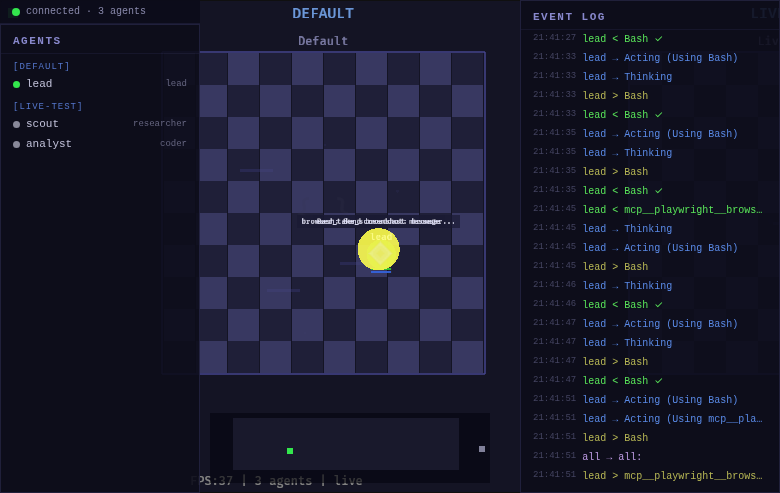
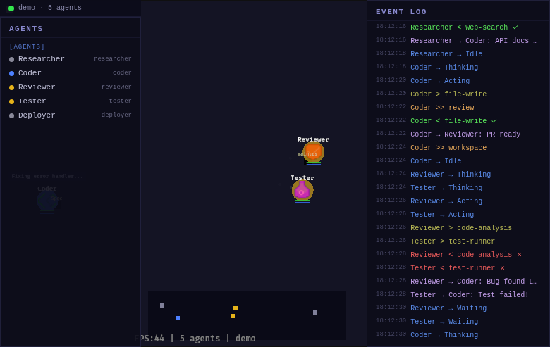
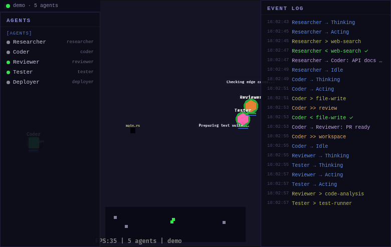

# AgentWorld v0.1.0

**Spatial visualization for multi-agent AI systems.** Watch your agents think, communicate, and collaborate in a living world — not a log file.

> Copyright 2026 TODOMODO.IO AGENCY LLC. Released under the MIT License.



AgentWorld transforms invisible AI orchestration into something you can *point at*. Agents appear as distinct characters in themed rooms. Messages arc visibly between them. Tool invocations flash. Errors turn red. When five agents are coordinating across three workspaces, you see the whole picture at a glance.

**Provider-agnostic.** If your agents emit structured events, AgentWorld can render them.

---

## Screenshots

### Agents at Work — Sprites, Status Rings, Thought Bubbles

*Each role has a unique pixel art sprite. Status rings pulse with state — thinking, acting, waiting, error. Thought bubbles show what each agent is considering.*

### Inspector Panel — Agent Details and Inventory

*Click any agent to inspect status, health, energy, tools used, current thought, and carried artifacts. Artifacts have kind-specific icons and quality indicators.*

### Live Mode — Real Agent Sessions

*Connected to a live event stream. Three agents across two teams, event log scrolling in real-time. The green dot confirms a live bridge connection.*

### Rooms and Portals — Spatial Navigation

*Agents traverse rooms through portals with a 3-phase animation (shrink, spin, teleport) and particle burst. Each room has its own color theme and ambient particles.*

### Full Interface — Roster, World, Event Log

*The complete interface: agent roster (left), spatial world view (center), timestamped event log (right), minimap (bottom).*

---

## What It Does

AgentWorld reads from an event stream — tool calls, messages, status changes, artifact transfers — and projects them into a spatial, real-time visualization running in your browser.

- **Agents** become characters with role-specific sprites, animated status rings, health/energy bars, movement trails, and thought bubbles
- **Messages** become visible projectiles arcing between sender and receiver, with content preview
- **Tool use** produces flash effects on invocation and colored result indicators (green check, red X)
- **Artifacts** are visible objects that agents create, carry, inspect, and hand off to each other
- **Rooms** are themed workspaces (blue/purple/green) with portals that agents traverse with particle effects
- **Teams** cluster into separate spatial bands so multi-team sessions stay readable

Everything renders in-browser via WebGL2. No install, no Electron, no native dependencies.

---

## Features

### Agents
- 7 distinct role-based pixel art sprites (16x16, runtime-generated)
- 5 animation states: idle bobble, thinking orbit, action flash, waiting sway, error shake
- Breathing status rings color-coded by state
- Health and energy bars, movement trails, thought bubbles

### Communication
- Message projectiles with arcing trajectories and content preview
- Connection lines revealing communication patterns
- Broadcast visualization — multi-target fan-out

### Tools and Artifacts
- Tool invocation flash effects with success/failure indicators
- 6 artifact kinds: Document, Code, Data, Image, Plan, MessageBundle
- Inventory system with kind icons and quality bars
- Artifact transfers visible between agents

### Rooms and Navigation
- Themed rooms: workspace (blue), review (purple), deploy (green)
- Distinct floor tiles, borders, corner decorations per theme
- Portal transitions with 3-phase animation and particle effects
- Ambient floating particles in room-themed colors
- Multi-team clustering with separate horizontal bands

### HUD (Preact Overlay)
- Agent roster grouped by team with clickable entries and status dots
- Scrollable event log — timestamped, color-coded, 200-entry buffer
- Inspector panel: name, role, status, room, health/energy, tools, thought, inventory
- Minimap with proportional agent dots
- Live connection status indicator synced from the engine

### Sound
- 8 procedural sound types via Web Audio API (no audio files needed)
- Spawn, despawn, portal, tool use/ok/fail, message ping, error alarm
- M key mute toggle

### Bridge Server
- SQLite poller (500ms interval) — reads from any SQLite event database
- State snapshots for late-joining clients
- `--replay` flag to replay the last hour of events
- `--team` filter for single-team focus
- Auto-spawns agents from unknown tool_use events
- Per-team color palettes (5 hue families)

### Demo Mode
- 5 agents across 3 rooms running a 16-step narrative cycle
- Full workflow: research, code, review, bug found, fix, re-test, deploy
- Portal warps and artifact handoffs — no setup, runs offline

---

## Quick Start

### Prerequisites

- [Rust](https://rustup.rs/) 1.89 (pinned in `rust-toolchain.toml`)
- WASM target: `rustup target add wasm32-unknown-unknown`
- [Trunk](https://trunkrs.dev/): `cargo install trunk`
- [Bun](https://bun.sh/) (for bridge server and frontend build)

### Demo Mode (no setup)

```bash
cd frontend && bun install && cd ..
trunk serve --address 0.0.0.0 --port 8080
# Open http://localhost:8080
```

### Live Mode (connect to real agents)

```bash
# Terminal 1: Bridge server
bun run bridge/server.ts --replay

# Terminal 2: WASM renderer
trunk serve --address 0.0.0.0 --port 8080

# Open http://localhost:8080/?ws=ws://localhost:9090/ws
```

### Service Scripts

```bash
./bin/start.sh          # Demo mode
./bin/start.sh --live   # Demo + bridge (live data)
./bin/stop.sh           # Stop all
./bin/status.sh         # Check running processes
```

### Controls

| Key | Action |
|-----|--------|
| Scroll | Zoom in/out |
| Middle mouse drag | Pan camera |
| 1-9 | Follow agent by index |
| H | Toggle help overlay |
| M | Toggle sound mute |
| Click roster entry | Inspect agent details + inventory |

---

## Architecture

```
agent-world/
├── crates/
│   ├── core/           # Pure Rust types + event-sourced state (zero framework deps)
│   └── game/           # Bevy 0.18 rendering — 10 plugins compiled to WASM
├── bridge/
│   └── server.ts       # SQLite → WorldEvents translator (Bun + WebSocket)
├── frontend/
│   └── src/            # Preact HUD overlay (28KB built)
└── index.html          # WASM entry point
```

**Core** — Provider-agnostic types and an event-sourced store. World state is a pure projection of the event stream. Replay and time-travel come free.

**Engine** — 10 plugins (world, agents, visuals, camera, HUD, events, adapter, sprites, sound, debug) compiled to WASM via WebGL2. Runs in any modern browser.

**Bridge** — Translates your event format into 19 WorldEvent types over WebSocket. Ships with a SQLite bridge; write your own for any event source.

**Frontend** — Preact overlay for HUD panels. The engine forwards events via `window.__agentworld_event()` and syncs state via `window.__agentworld_sync()`.

| Component | Technology |
|-----------|-----------|
| Core types | Rust (no framework deps) |
| Engine | Bevy 0.18 + WebGL2 |
| WASM build | Trunk |
| HUD overlay | Preact + @preact/signals |
| Frontend build | Bun |
| Bridge server | Bun + SQLite |
| Sound | Web Audio API (procedural) |
| Sprites | Runtime-generated from const pixel arrays |

---

## Connecting Your Agents

AgentWorld visualizes any system that emits structured events. The included bridge reads from SQLite:

```sql
CREATE TABLE events (
  id INTEGER PRIMARY KEY,
  hook_event_type TEXT,
  event_category TEXT,
  team_name TEXT,
  agent_name TEXT,
  agent_type TEXT,
  payload TEXT,       -- JSON
  summary TEXT,
  timestamp INTEGER
);
```

For other event sources, write a bridge that emits any of the 19 WorldEvent types over WebSocket. See `crates/core/src/events.rs` for the full type definitions.

---

## Documentation

This repository includes a **comprehensive manual** at [`docs/manual.html`](docs/manual.html) — a self-contained, dark-themed HTML document covering all 27 sections of AgentWorld in detail, with 24 annotated screenshots. The manual is the authoritative reference for every feature, configuration option, keyboard shortcut, and architectural decision.

**Start there.** This README provides an overview; the manual provides depth.

---

## Version

**v0.1.0** — First public release. ~5,000 lines of Rust, ~500 lines of TypeScript/TSX. 10 engine plugins, 19 event types, 6 core tests.

---

## License

MIT License. Copyright 2026 TODOMODO.IO AGENCY LLC. See [LICENSE](LICENSE) for details.
